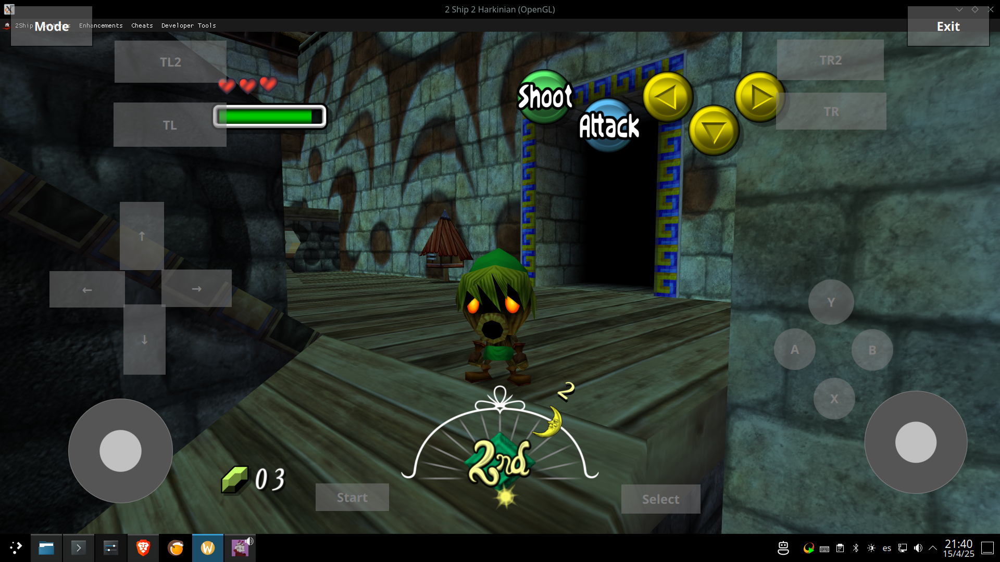

# VirtualJoy
On screen virtual gamepad for touch devices on Linux

Usage:

Launch your game (in window mode)
Launch this app

This gamepad will appear on top of your game 

Press Mode button to change position/resize of controls

